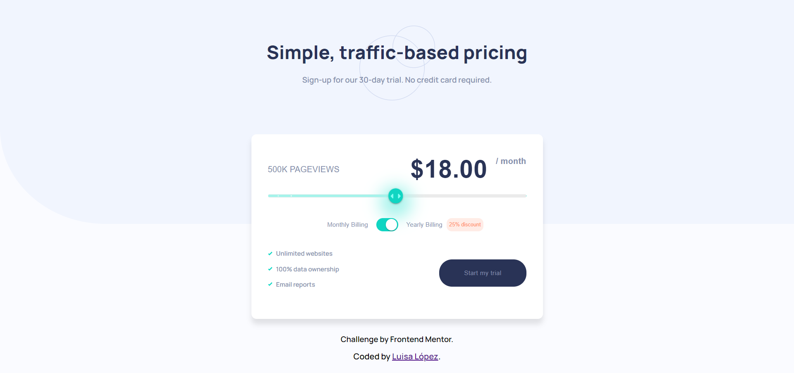

# Frontend Mentor - Interactive pricing component solution

This is a solution to the [Interactive pricing component challenge on Frontend Mentor](https://www.frontendmentor.io/challenges/interactive-pricing-component-t0m8PIyY8). Frontend Mentor challenges help you improve your coding skills by building realistic projects.

## Overview

### The challenge

Users should be able to:

- View the optimal layout for the app depending on their device's screen size
- See hover states for all interactive elements on the page
- Use the slider and toggle to see prices for different page view numbers

### Screenshot

### Links

- [Solution URL](https://github.com/luisamlopez/interactive-pricing-component)
- [Live Site URL](https://interactive-pricing-componentfm.netlify.app/)

## My process

### Built with

- Semantic HTML5 markup
- CSS custom properties
- Flexbox
- Javascript
- Mobile-first workflow
- [React](https://reactjs.org/) - JS library
- [MUI Library](https://mui.com/) - For styles

## Author

- Frontend Mentor - [@luisamlopez](https://www.frontendmentor.io/profile/luisamlopez)
